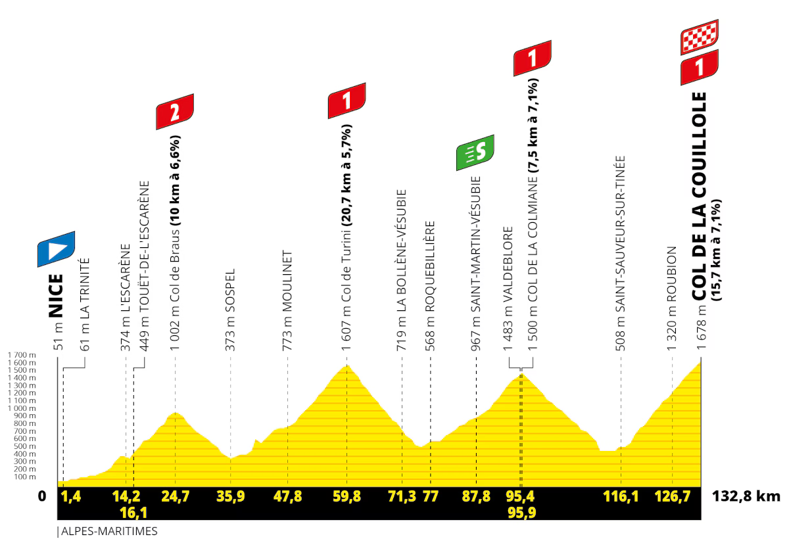
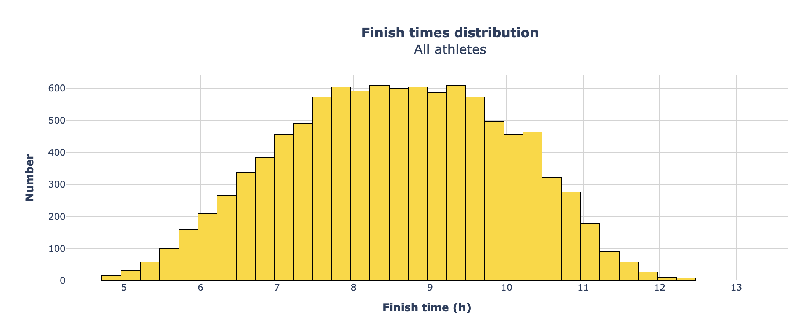
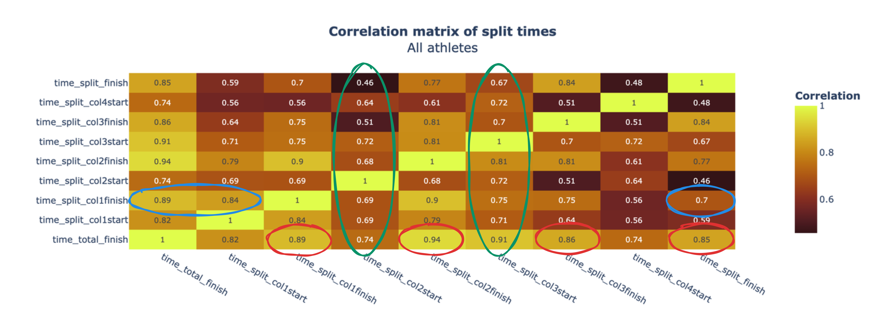
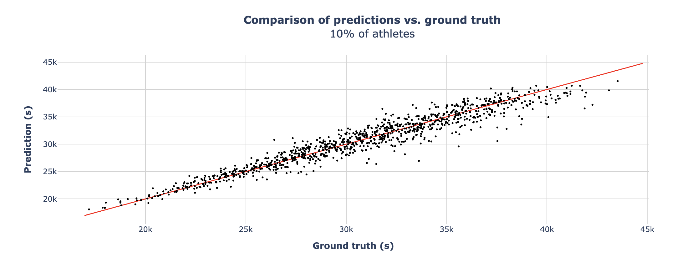

# L'Étape du Tour 2024

**L'arrière-pays niçois et ses célèbres cols de Turini ou de la Couillole étaient le théâtre de la dernière édition de *L'Étape du Tour*, cette célèbre cyclosportive reprenant le tracé de l'une des étapes reines du Tour de France. Avec plus de 10 000 finishers, et un suivi chronométré détaillé, c'est une superbe mine de données pour analyser les performances d'athlètes dans un sport d'endurance. Dans cet article, nous chercherons à savoir à quel point les deux premières acensions du parcours permettent de prédire le temps final.**

## L'EDT, mode d'emploi

4:46'25". C'est le chrono du tout dernier cycliste à avoir franchi la ligne d'arrivée lors de la 20ème étape du dernier Tour de France, Nice - Col de la Couillole. Un gouffre avec le vainqueur ce jour là, Tadej Pogacar, qui avait bouclé sa journée en à peine plus de quatre heures. Mais pourtant, seulement 3 cyclistes de *L'Étape du Tour* - sur les 15 000 participants au départ - avaient réussi à aller plus vite quelques jours plus tôt. L'occasion de réaliser le monde qui sépare les meilleurs sportifs profesionnels de la planète des meilleurs amateurs.

Car oui, *L'Étape du Tour* est une compétition qui regroupe la crème de la crème des cyclistes amateurs. Souvent abbrégée "EDT" dans le jargon, elle est l'une - si ce n'est LA - des cyclosportives les plus réputées, que ce soit en France ou à l'internationale. Organisée en intégralité sur routes fermées (une exception dans le paysage sportif français), et reprenant surtout le tracé de l'une des étapes du Tour de France au kilomètre près, elle est un défi assez unique.

En effet, ce n'est pas n'importe quelle étape à laquelle se frotte les athlètes, mais toujours l'une des plus dures de l'édition. L'année passée, les participants ont donc dû affronter 130 kilomètres et environ 4500 mètres de dénivelé positif. Au programme, quatre cols majeurs : le col de Braus, le col de Turini, le col de la Colmiane, et enfin la redoutable montée finale au col de la Couillole.

L'organisation avait découpé le parcours en 8 segments intermédiaires : du départ au pied du premier col, du pied du premier col à son sommet, du sommet du premier col au pied du deuxième... et ainsi de suite. Pour faire simple, une première partie relativement plate, suivie de quatre ascensions et trois descentes. **Nous allons donc nous intéresser à l'influence qu'ont eu les temps des quatre premiers intermédiaires (jusqu'au sommet du col de Turini, donc) sur le temps final de chaque participant**.

## Première approche exploratoire

### Statistiques descriptives

Pour commencer, intéressons-nous à certaines statistiques élémentaires. Exactement **10 614 cyclistes** sont parvenus à terminer l'épreuve, pour un **temps moyen final de 8:32'51"**. La distribution de tous les chronos est à retrouver sur l'histogramme ci-dessous, où chaque barre représente un intervalle de 15 minutes.

### Matrice des corrélations

Mais c'est surtout la matrice des corrélations qui nous intéresse le plus et qui est porteuse du plus d'enseignements. Nous nous sommes donc intéressés aux corrélations entre chaque temps intermédiaire, ainsi qu'avec le temps final. Pour rappel, une corrélation est comprise entre -1 et 1, et permet d'observer la relation linéaire entre deux variables. Une corrélation positive indique que les deux variables tendent à augmenter ensemble, tandis que si elle est négative, cela signifie que l'une tend à diminuer lorsque l'autre augmente. Ici, nous n'avons que des corrélations positives, d'où une échelle de couleur seuillée autour de 0,5.

Nous pouvons formuler trois observations en particulier :

- **La corrélation la plus élevée entre la durée d'ascension sur l'un des cols et le temps total est avec le deuxième col**, là où elle est significativement plus basse sur les trois autres montées (annotations rouges). Cela est cohérent avec le fait que les amateurs (surtout sur un profil aussi difficile - mais très grand public dans le même temps) ne se connaissent pas forcément bien, et peuvent donc avoir tendance à se laisser griser par l'effet de groupe, et in fine à ainsi partir trop fort. Leur temps d'ascension en début de course sera donc trop rapide par rapport à leur temps final, de même que leurs ascensions de fin de course pourront être trop lentes en comparaison. A l'inverse, certains cyclistes partiront plus prudemment pour finir plus vite (une sorte de *negative split* pour reprendre des termes de course à pied), faisant là aussi diminuer la corrélation avec le chrono final. Le deuxième col, au coeur du parcours, est donc celui le moins impacté par des baisses et hausses de régime.

- **Les plus faibles corrélations sont sur les transitions entre les cols** (annotations vertes). Cela semble logique, car la majeure partie de ces transitions sont des descentes, où la technique requise ne va pas forcément de paire avec les capacités physiques des cyclistes. Néanmoins, les corrélations sont quand même positives (et assez éloignées de 0), ce qui s'explique par le fait que les pauses sont le plus souvent effectuées lors de ces transitions (au sommet des cols en particulier). La durée des pauses sera donc souvent proportionnelle au temps total. De plus, il est intéressant de noter que la transition avec les plus fortes corrélations avec le reste des intermédiaires est la troisième, entre le sommet du col de Turini et le pied du col de la Colmiane. Ce dernier n'était pas situé à Roquebillière, mais seulement à l'entame de la partie raide de la montée. Une longue partie de la transition était donc en faux-plat montant, effort qui se rapproche des ascensions, et qui explique des corrélations plus fortes avec les montées.

- Le temps d'ascension sur le premier col est fortement corrélé avec la durée sur la première portion plate qui suit le départ - ce qui semble parfaitement logique - mais l'est beaucoup moins avec le temps d'ascension lors de la dernière montée (annotations bleues). A nouveau, cela illustre bien les **différentes stratégies d'allure**, entre ceux qui ont explosé sur la fin, et ceux qui au contraire ont réussi à finir plus fort qu'au début.

## Estimation du temps total

### Paramètres du modèle

Dans un deuxième temps, nous nous sommes intéressés à essayer de prédire le temps total en se basant sur les temps intermédiaires des deux premiers cols, de la première descente, et de la portion plate après le départ. Nous avons aussi pris en compte l'âge des participants, leur sexe, et leur numéro de dossard (basé sur des performances passées, ou sur les estimations du temps total des athlètes eux-mêmes).

Nous avons utilisé un modèle de *Machine Learning*, en l'occurence un régresseur ***LightGBM***. C'est un algorithme de *gradient boosting* réputé pour ses très bonnes performances en comparaison de ses coûts de calcul relativement faibles (pour un modèle de ce type). Nous l'avons entraîné sur **90% des athlètes**, et avons donc gardé les 10% restants pour évaluer la précision de nos estimations.

### Résultats

Les résultats sont à retrouver sur la figure ci-dessous, qui représente les prédictions en fonction des vraies valeurs.

Nous pouvons observer que celles-ci sont très correctes (pour des non initiés, plus les points noirs sont proches de la droite rouge, plus les estimations sont proches de la réalité). D'un point de vue chiffré, **l'erreur moyenne - en valeur absolue - est égale à 17'30"**. Cela représente 6% du temps du vainqueur, et seulement 3% du temps moyen. De très bons résultats donc, mais qui sont logiques puisqu'environ la moitié de la course est connue du modèle, et que la majorité des cyclistes est en capacité de maintenir une allure relativement constante tout du long du parcours.

Bien sûr, nous pouvons quand même observer le phénomène décrit dans la section précédente, avec des estimations trop faibles par rapport au temps final. Ces points représentent très sûrement des athlètes qui se sont surrestimés et qui n'ont pas tenu leur allure du début de course. A l'inverse, les points situés au-dessus de la droite rouge (moins nombreux que ceux dessous) représentent sûrement des athlètes qui sont partis en-dedans et qui ont fini fort.

Enfin, les erreurs sont moins importantes pour les meilleurs. Ces derniers sont des sportifs de haut niveau, et connaissent pour la plupart parfaitement leur corps. Ils sont donc capables de maintenir un effort constant du début à la fin, résultant en des estimations finales cohérentes avec le début de course. C'est moins le cas pour des amateurs plus occasionnels, pour lesquels une telle épreuve est plus aléatoire.

## Recommandations

Pour conclure, une recommandation relativement basique serait de ne pas se laisser emporter par l'évènement et le fait de rouler en peloton, afin de ne pas se mettre dans le rouge pour la fin de parcours et d'avoir un effort le plus linéaire possible. C'est une remarque qui s'adresse essentiellement aux personnes n'ayant pas l'habitude de ce genre de course.

Pour les meilleurs amateurs, ou des personnes se connaissant très bien, il sera plutôt recommandé de tenter de suivre d'autres personnes avec un niveau légèrement supérieur, afin de profiter au maximum de l'effet d'aspiration, voire de l'émulation de rouler en groupe. Le temps gagné sur des portions plus faciles pourra compenser une éventuelle baisse régime sur la fin de course.
